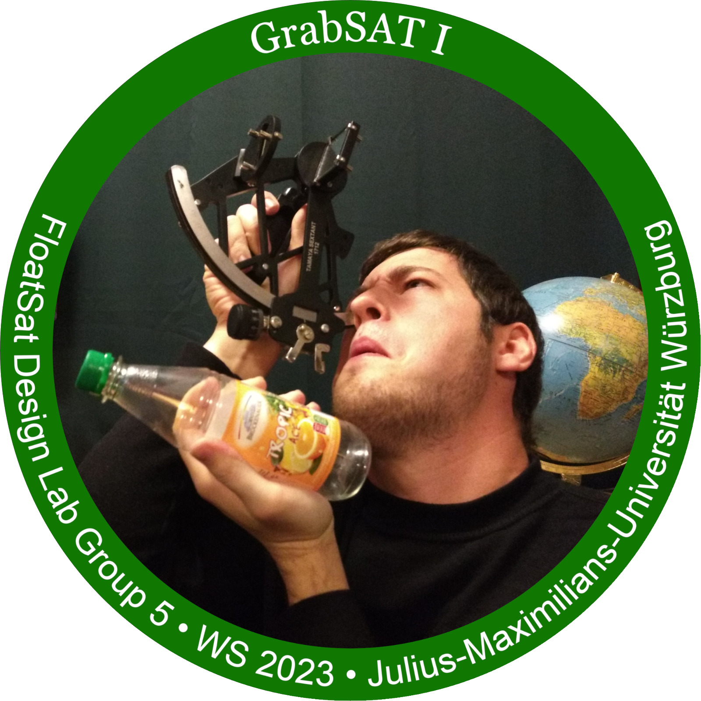

# FloatSat praktikum

In the FloatSat lab, we were tasked with performing one-axis attitude and rate control of satellite on a spherical air bearing. A reaction wheel was used to produce control torque through moment exchange.

    GrabSat-I logo designed by and featuring Marvin Baral.  

Our team decided to work on a debris collection mission, which we named **GrabSat-I**. The goal is to control satellite's orientation to rotate toward magnetic debris, extend an arm to grab it, and retrieve the debris. My role in the project was the design and development of embedded firmware and control systems.

1. [Report: Control systems design for FloatSat](https://www.overleaf.com/read/vprknftnbdwg#927df9)
2. [Report: Discrete PID controller](https://www.overleaf.com/read/wmkhdnhyztcy#711179)
3. [Project demonstration video](https://www.youtube.com/watch?v=Jaxn8oI8_Fc)

**Note:** I ended up working part-time in the same lab as a control engineer and often pondered how the control system could be improved. As a result, this project report extends beyond what I did in the first semester. The current version of the report is based on the theoretical analysis and experiments that I conducted later in the lab on my own time.
